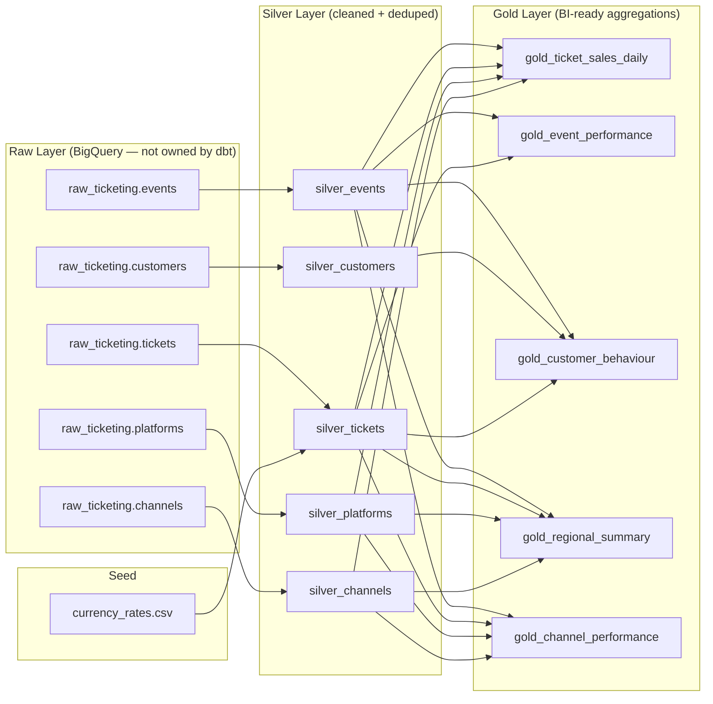

# dbt MVP — Global Ticketing Platform Analytics

A production-grade dbt project implementing a **Medallion Architecture (Raw → Silver → Gold)** for a global ticketing platform analytics system. Data is aggregated from multiple platforms across US, EU, APAC, and LATAM, with a full channel attribution layer powering CIO/CTO executive dashboards.

---

## Architecture Overview



---

## Project Structure

```
dbt-etl/
├── dbt_project.yml
├── profiles.yml
├── packages.yml
├── run_pipeline.sh
├── seeds/
│   └── currency_rates.csv
├── sources/
│   └── sources.yml
├── models/
│   ├── silver/
│   │   ├── silver_events.sql
│   │   ├── silver_customers.sql
│   │   ├── silver_tickets.sql
│   │   ├── silver_platforms.sql
│   │   ├── silver_channels.sql
│   │   └── schema.yml
│   └── gold/
│       ├── gold_ticket_sales_daily.sql
│       ├── gold_event_performance.sql
│       ├── gold_customer_behaviour.sql
│       ├── gold_regional_summary.sql
│       ├── gold_channel_performance.sql
│       └── schema.yml
├── tests/
│   ├── assert_revenue_non_negative.sql
│   ├── assert_sell_through_rate.sql
│   └── assert_channel_revenue_share_sums_to_100.sql
└── macros/
    └── generate_schema_name.sql
```

---

## File Inventory

| File | Purpose |
|------|---------|
| `dbt_project.yml` | Project config — schema routing, materialisation defaults |
| `profiles.yml` | BigQuery OAuth (dev) + service account (prod) connections |
| `packages.yml` | `dbt_utils >= 1.0.0` for surrogate key generation |
| `run_pipeline.sh` | Orchestration script: deps → seed → silver → gold → test |
| `seeds/currency_rates.csv` | 20 major currencies → USD rates for price normalisation |
| `sources/sources.yml` | All 5 raw source tables with full column-level tests |
| `macros/generate_schema_name.sql` | Produces clean dataset names (`silver`, `gold`, not prefixed) |

---

## Models

### Silver Layer

Responsible for cleaning, deduplication, type casting, and standardisation of raw source data. All incremental models use a **3-day lookback** on `ingested_at` to handle late-arriving data.

| Model | Materialisation | Key Design |
|-------|----------------|------------|
| `silver_events` | Incremental (merge) | Dedup on `event_id`, 3-day lookback |
| `silver_customers` | Incremental (merge) | PII comment-flagged, loyalty UPPER |
| `silver_tickets` | Incremental (merge) | Partitioned by date, USD normalised via seed join |
| `silver_platforms` | Table | Full refresh — small reference dataset |
| `silver_channels` | Incremental (merge) | Active-only filter, `channel_age_days` derived metric |

### Gold Layer

Pre-aggregated, BI-ready models consumed by stakeholder dashboards. All revenue figures are in USD.

| Model | Grain | Key Metrics |
|-------|-------|-------------|
| `gold_ticket_sales_daily` | event × day × platform × region × channel | `revenue_usd`, `tickets_sold`, `revenue_by_channel_usd` |
| `gold_event_performance` | event | `sell_through_rate_pct`, `cancellation_rate_pct`, `channel_count` |
| `gold_customer_behaviour` | customer | `lifetime_spend_usd`, `preferred_channel`, `days_since_last_purchase` |
| `gold_regional_summary` | region × month | `top_channel_by_revenue`, `direct_vs_partner_vs_vendor_split` |
| `gold_channel_performance` | channel × month | `channel_revenue_share_pct`, `cancellation_rate`, `refund_rate` |

---

## Tests

### Schema Tests (Generic)
Applied via `schema.yml` on source, silver, and gold models:
- `not_null` and `unique` on all primary keys
- `accepted_values` on `channel_type` (`DIRECT`, `PARTNER`, `VENDOR`), `ticket_status` (`booked`, `cancelled`, `refunded`), `loyalty_tier`
- `relationships` to enforce FK integrity across silver models

### Singular Tests

| Test | Validates |
|------|-----------|
| `assert_revenue_non_negative` | No booked ticket has `face_value_usd < 0` |
| `assert_sell_through_rate` | No event's tickets sold exceeds 100% of its capacity |
| `assert_channel_revenue_share_sums_to_100` | `SUM(channel_revenue_share_pct)` per month equals 100 (±0.1 tolerance) |

---

## Key Design Decisions

### Incremental Strategy
All Silver models use a 3-day lookback window to handle late-arriving data from partner platforms and ensure idempotent re-runs:

```sql
where ingested_at >= timestamp_sub(
  (select max(ingested_at) from {{ this }}),
  interval 3 day
)
```

### Currency Normalisation
`silver_tickets` joins the `currency_rates` seed on `from_currency`, producing `face_value_usd`. All Gold models aggregate exclusively on `face_value_usd` — never on the raw `face_value` column.

### Channel Attribution
`silver_channels` exposes **only active channels** (`is_active = TRUE`). All Gold models join via `silver_tickets.channel_id → silver_channels.channel_id`. Inactive channels are excluded from attribution rather than surfacing as nulls in BI tools.

### Schema Naming
The `generate_schema_name` macro bypasses dbt's default prefixing behaviour, producing `silver`, `gold`, and `seeds` as clean BigQuery dataset names — not `dbt_dev_silver` etc.

> **Note:** If you want environment-namespaced schemas (e.g. `dev_silver`, `prod_silver`), modify the macro to include `target.name` as a prefix.

### PII Handling
`silver_customers` and `gold_customer_behaviour` carry PII fields (`first_name`, `last_name`, `email`, `phone`) ingested as-is per MVP scope. They are:
- Flagged with inline SQL comments: `-- PII: to be masked in post-MVP`
- Tagged in `schema.yml` with `pii_present: true` meta

Masking is planned for the post-MVP phase.

---

## Getting Started

### Prerequisites
- Python 3.9+ with dbt-bigquery installed (`pip install dbt-bigquery`)
- A GCP project with BigQuery enabled
- BigQuery datasets pre-created: `raw_ticketing`, `silver`, `gold`

> **Important:** dbt creates tables and views inside datasets but will **not** create datasets themselves.

### 1. Configure your GCP project

```bash
export PROJECT_ID=techno-pie-mk-01
export ENV=dev

```

Edit `profiles.yml` — replace `your-gcp-project-id` and the service account key path for prod:

```yaml
ticketing_analytics:
  target: dev
  outputs:
    dev:
      type: bigquery
      method: oauth
      project: your-gcp-project-id
      ...
```

### 2. Install packages

```bash
# Create virtual environment
python -m venv .venv

# Activate it
source .venv/bin/activate

# Upgrade pip
pip install --upgrade pip

# Install dbt packages
pip install dbt-core==1.11.9 dbt-bigquery==1.11.1

dbt deps
```

### 3. Load the currency seed

```bash
dbt seed
```

### 4. Run the full pipeline

```bash
# Dev environment (uses OAuth)
./run_pipeline.sh dev

# Prod with full refresh of all incremental models
./run_pipeline.sh prod --full-refresh
```

### 5. Run only tests

```bash
dbt test
```

### 6. Run a specific layer

```bash
# Silver only
dbt run --select tag:silver

# Gold only
dbt run --select tag:gold

# Specific model
dbt run --select silver_channels
```

### 7. Generate and serve dbt docs

```bash
GENERATE_DOCS=true ./run_pipeline.sh dev
# Docs served at http://localhost:8080
```

---

## Non-Functional Requirements

- All SQL is valid **BigQuery Standard SQL**
- All models have descriptions in `schema.yml` (required for `dbt docs`)
- `dbt_utils.generate_surrogate_key()` is used for all composite keys in Gold models
- No hardcoded project/dataset references — exclusively `{{ source() }}` and `{{ ref() }}`
- Meta tags on all models: `owner`, `team`, `pii_present`, `layer`
